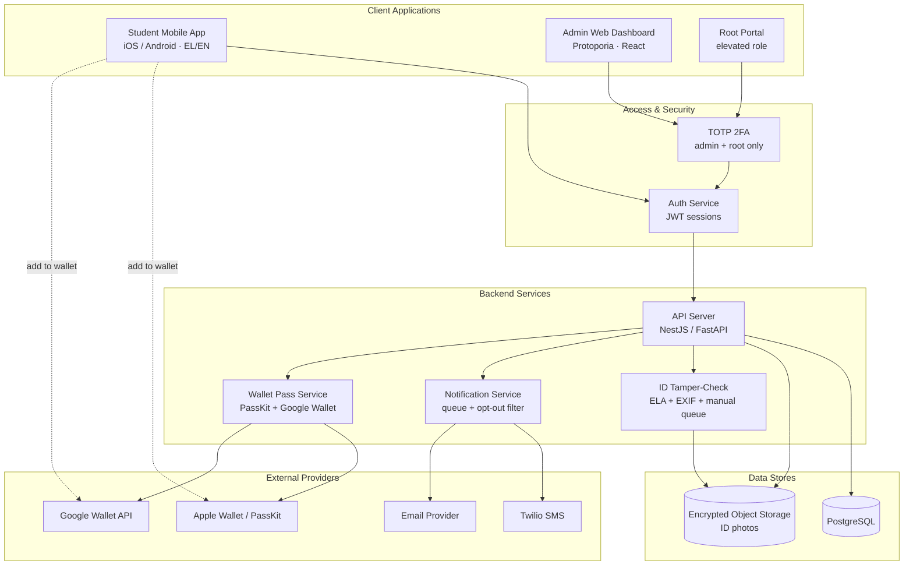
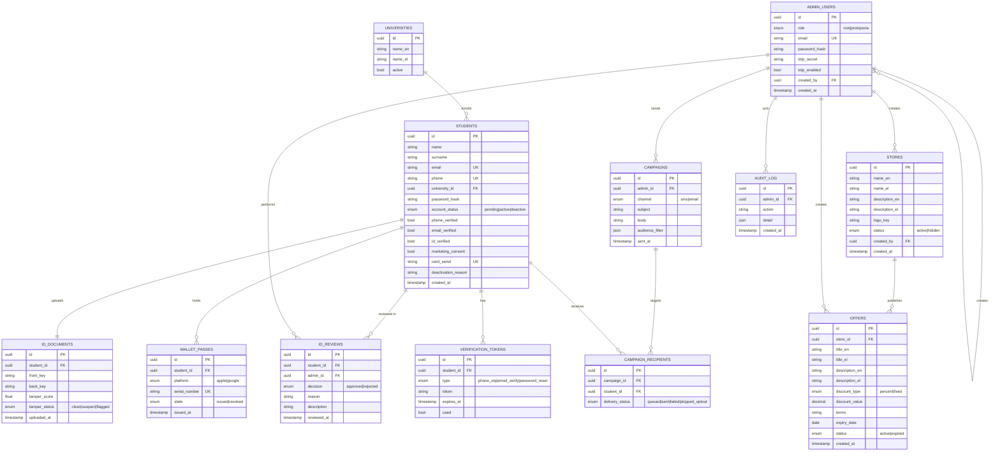

# Blue Card — System Design (v1)

A student discount-card platform. Students register on a native mobile app, get verified, and receive a visual discount card in Apple/Google Wallet. Protoporia admins manage students, stores, and offers from a web dashboard.

## Locked decisions (v1)

- **Roles:** root (creates admins), Protoporia admin (web dashboard), student (native iOS/Android). Stores and offers are data records — no store login.
- **Activation rule:** `account_status = active` when **phone_verified = true AND id_verified = true**. Email verification is *not* an activation gate in v1.
- **Card:** visual-only pass in Apple/Google Wallet. **No savings/redemption tracking** in v1.
- **ID review:** automated tamper score **plus** manual admin decision.
- **2FA:** TOTP (authenticator app) for admin + root only.
- **Messaging:** Twilio for SMS, transactional email provider for mail. Marketing requires stored **opt-in consent + opt-out link**; verification/rejection mails are transactional (exempt).
- **Bilingual:** Greek + English throughout (data stored per-language where user-facing).
- **Scale target:** ~15k students, ~100 stores.

---

## System architecture

---

## Data model

---

## Key flows

### 1. Registration → activation
1. Student submits name, surname, email, phone, university (dropdown), ID front + back photos.
2. `students` row created with `account_status = pending`, all verify flags `false`. ID photos uploaded to encrypted storage; `id_documents` row created and queued for tamper-check.
3. Student verifies phone via Twilio OTP → `phone_verified = true`. (Email verify link optional, sets `email_verified` but does not gate activation.)
4. Admin reviews ID (see flow 2). On approval → `id_verified = true`.
5. System rule fires: if `phone_verified && id_verified` → `account_status = active`, issue `wallet_pass`, notify student "card ready" (SMS/email).

### 2. ID review (automated + manual)
1. Tamper-check runs on upload: EXIF/metadata inspection, error-level analysis (ELA), resave/clone heuristics → `tamper_score` + `tamper_status` (clean / suspect / flagged).
2. Admin sees the photos plus the tamper flag in the student detail view. Automated result is advisory — the human decides.
3. **Approve** → `id_verified = true`, `id_reviews` logged.
4. **Reject** → admin must enter `reason` + `description`; stored in `id_reviews`; emailed automatically to the student. `id_verified` stays false.

### 3. New store / new offer → broadcast
- On create, enqueue an email to all students where `account_status = active`. (Spec says inform active+verified students; active already implies verified under the activation rule.)
- Sent via Notification Service; this is arguably promotional, so apply the marketing-consent + opt-out filter to be safe.

### 4. Marketing campaign (advertising page)
1. Admin selects audience (filters: status, university, etc.) and channel (SMS/email).
2. Notification Service expands the audience, **drops anyone with `marketing_consent = false`** (`delivery_status = skipped_optout`), appends an opt-out link/keyword, then sends via Twilio/email.
3. Per-recipient delivery status recorded in `campaign_recipients`.

### 5. Forgot password
- Student requests reset → `verification_tokens` row (`type = password_reset`, short expiry) → email with deep link → new password set → token marked `used`.

---

## Admin dashboard pages

- **Main / analytics:** signups over time, active vs pending counts, active offers, store count.
- **Students table:** unique id, email, phone, status, barcode/card serial, email-verify, phone-verify, id-verify. Row actions: send recovery email, recreate barcode, open ID review, set id-verify, deactivate (manual, with reason).
- **Advertising:** audience builder + SMS/email composer (consent-filtered).
- **Stores:** create/list stores; create/list offers per store.

## Student app pages (Foody/Wolt-style)

- **Home:** promotional banners/carousel.
- **Stores & offers:** searchable list/grid of stores with logos, descriptions, and their offers.
- **Profile:** profile info, verification status, "Add to Apple/Google Wallet" (enabled only when active).

---

## Suggested build order

1. **Foundation:** data model + migrations, auth (students password; admin/root password + TOTP), university seed data, i18n scaffolding (EL/EN).
2. **Registration + verification:** signup, ID upload to encrypted storage, Twilio phone OTP, password reset.
3. **Admin core:** students table, ID review with manual decide + reject-reason email, manual deactivate, audit log.
4. **Tamper-check:** integrate automated scoring into the upload pipeline, surface flag in review UI.
5. **Stores & offers:** CRUD + the broadcast-on-create email.
6. **Wallet:** PassKit + Google Wallet pass issuance on activation (this has the longest external-setup lead time — start the Apple Developer + Google Wallet API accounts early).
7. **Advertising:** audience builder, consent filter, campaign send + per-recipient tracking.
8. **Analytics + polish:** dashboard metrics, bilingual QA, mobile home/stores UI.

## Notes / risks to track

- **GDPR:** ID photos are sensitive data — encrypt at rest, restrict access, define a retention/deletion policy, log every admin view in `audit_log`.
- **Tamper detection is probabilistic** — set expectations that it assists the reviewer rather than replacing them; never auto-reject on score alone.
- **Wallet setup is the critical-path dependency** — Apple Developer (~$99/yr) and Google Wallet API issuer onboarding both take time and approval.
- **SMS cost:** at 15k students, bulk SMS campaigns add up; email is the cheaper default for broadcasts.
